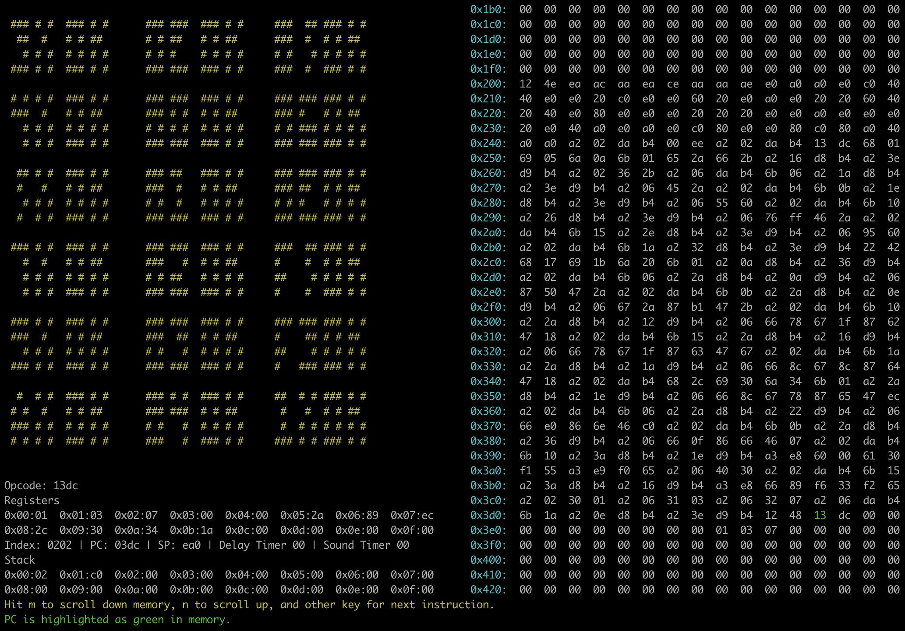

# CHIP-8 Emulator

Currently, the CPU instructions are fully implemented and functional with the exception of those pertaining to keypresses, as I left my 4x4 keypad matrix at home. Additionally, the clock speed will need to be adjusted. 

For graphical output, I've wired my Pi to a 128x64 SSD1306 oled display, with each of the 64x32 CHIP-8 pixels scaled up by 4. 

Currently, it passes all tests that don't involve keypresses.

I found [Cowgod's Chip-8 Technical Reference](http://devernay.free.fr/hacks/chip8/C8TECH10.HTM) to be highly useful in implementing this emulator.

To use the debugger, `ncurses` is required: `sudo apt-get install libncurses5-dev libncursesw5-dev`.

For a quick demo of the debugger, use `make test`.

Debugger in action: 

