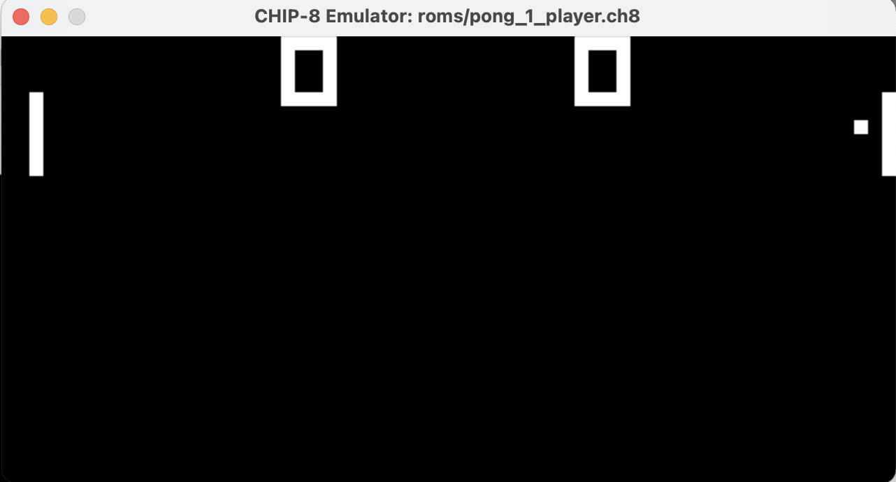

# CHIP-8 Emulator

Graphics are implemented using SDL. All instructions/features are implemented currently (it passes all tests) with the exception of the buzzer, and the clock speed also needs to be tuned.

Here is the emulator running pong:

## Setup & usage

Just clone, run `make`, then `./emu [rom file]`. The 4x4 keypad is mapped to the leftmost 4 keys on each row, and `ESC` exits the emulator. 

## Debugger

To use the debugger, `ncurses` is required: `sudo apt-get install libncurses5-dev libncursesw5-dev`.

For a quick demo of the debugger, use `make test`.

Debugger in action: 

For another means of graphical output, I've wired my Pi to a 128x64 SSD1306 oled display, with each of the 64x32 CHIP-8 pixels scaled up by 4. 

## Credit
I found [Cowgod's Chip-8 Technical Reference](http://devernay.free.fr/hacks/chip8/C8TECH10.HTM) to be highly useful in implementing this emulator.
